# Task Graph: ui-sidebar-tabs

**PRD:** `_prd.md`
**TechSpec:** N/A (features UI straightforward)
**Total Tasks:** 6
**Estimated Waves:** 3

---

## Graph

```dot
digraph tasks {
  rankdir=LR;
  node [shape=box];

  task_01 [label="01\nHook useSidebarCollapsed"];
  task_02 [label="02\nSidebar colapsável"];
  task_03 [label="03\nTopbar toggle button"];
  task_04 [label="04\nTestes sidebar"];
  task_05 [label="05\nButtonTabs component"];
  task_06 [label="06\nIntegrar no financeiro"];

  task_01 -> task_02;
  task_02 -> task_03;
  task_03 -> task_04;
  task_04 -> task_05;
  task_05 -> task_06;
}
```

## Waves

| Wave | Tasks | Dependências |
|---|---|---|
| 1 | task_01, task_05 | Nenhuma (paralelizáveis) |
| 2 | task_02, task_06 | task_01, task_05 |
| 3 | task_03, task_04 | task_02 |

---

## Tasks

| # | Arquivo | Titulo | Tipo | Dependências |
|---|---|---|---|---|
| 01 | `task_01.md` | Hook `useSidebarCollapsed` | frontend | — |
| 02 | `task_02.md` | Sidebar colapsável | frontend | 01 |
| 03 | `task_03.md` | Botão toggle no topbar | frontend | 02 |
| 04 | `task_04.md` | Testes da sidebar | test | 03 |
| 05 | `task_05.md` | Componente `ButtonTabs` | frontend | — |
| 06 | `task_06.md` | Integrar ButtonTabs no financeiro | frontend | 05 |

---

## Test Mapping

| Test Case | Task |
|---|---|
| Sidebar inicia expandida por padrão | 02 |
| Sidebar colapsa ao clicar toggle | 03 |
| Estado persiste em localStorage | 01 |
| Sidebar colapsada mostra apenas ícones | 02 |
| Tooltips aparecem no hover (colapsado) | 02 |
| Mobile não é afetado pelo colapso | 02 |
| ButtonTabs renderiza triggers e content | 05 |
| ButtonTabs muda valor ao clicar | 05 |
| ButtonTabs variants funcionam | 05 |
| Financeiro usa ButtonTabs | 06 |
